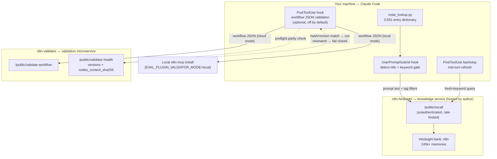

# n8n Knowledge — Claude Code Plugin

**v0.3.7**

A Claude Code plugin that makes Claude better at n8n. When it detects you're working on
n8n, hooks automatically recall curated n8n knowledge (docs, GitHub issues with status,
community workarounds, node specs) and inject it as context — no web-search permissions, no
MCP server, no API keys. When Claude writes a workflow JSON file, an optional `PostToolUse`
hook validates it against the real n8n validation engine, feeds the errors back, and lets
Claude fix them in the same turn.

The knowledge is served by a hosted [Hindsight](https://github.com/dbenn8/n8n-hindsight)
memory instance (bank `n8n`, 245k+ memories). Validation is served either by a cloud
validator microservice or by a local `n8n-mcp` install you point it at. Both the knowledge
service and the validator are open source and self-hostable — see
[n8n-hindsight](https://github.com/dbenn8/n8n-hindsight).

> **Trust note up front:** auto-recall sends your prompt text to the author's hosted recall
> endpoint when n8n context is detected, and the optional validator can send your workflow
> JSON to a cloud service. Read [What data leaves your machine](#what-data-leaves-your-machine)
> before installing. Everything is local-only or self-hostable if you'd rather it not.

## Install

```bash
/plugin install n8n-knowledge@n8n-knowledge-local
```

Or clone and install as a local marketplace:

```bash
git clone https://github.com/dbenn8/n8n-knowledge.git
# In Claude Code:
# /plugin marketplace add /path/to/n8n-knowledge
# /plugin install n8n-knowledge@n8n-knowledge-local
```

No setup, API keys, or configuration required to start. The plugin ships with the node
lookup dictionary checked in and points at the hosted knowledge service by default.

## Architecture

Three repos, one system. This plugin is the client; the other two are the backend.



- **Recall path:** prompt text (+ tag filters for detected node names) goes to
  `/public/recall`, which serves from the `n8n` Hindsight bank. The endpoint is
  unauthenticated and rate-limited; the key is injected server-side by nginx.
- **Validation path:** workflow JSON goes to `/public/validate-workflow` (cloud) or a local
  `n8n-mcp` install (local mode). Before an eval run trusts a validator, it compares the
  validator's `nodes_content_sha256` and engine versions against its own via
  `/public/validator-health` and **fails closed on mismatch** — so plugin-time validation
  and post-hoc scoring can never silently use different node data.

## What it does

### Design layer (gotchas, issues, docs)

- **Auto-recall** — detects n8n keywords in your messages and injects relevant docs, issues,
  and community solutions as context (~5 results, sub-second).
- **Manual recall** — `/n8n-knowledge` searches deeper when auto-recall didn't trigger (~20 results).
- **Confidence scoring** — each result annotated HIGH/MEDIUM/LOW based on source type and
  engagement metrics (votes, likes, views, solved status), with user-configurable thresholds.
- **GitHub issue state** — every GitHub result is prefixed with its canonical state, e.g.
  `[OPEN]` or `[CLOSED·completed·2026-02-26]` / `[CLOSED·not_planned·…]`. The model is warned
  that `[CLOSED·completed]` usually means already fixed and `[CLOSED·not_planned]` means n8n
  won't fix it — so it never builds a workaround for a bug that's already resolved.
- **Backstop recall** — refreshes n8n context *during* an agentic turn (after Edit/Write/Task),
  not just on your prompt — gated, deduped, and capped. See [Backstop recall](#backstop-recall-mid-turn-context).
- **Source citations** — every result links to the specific doc page, GitHub issue, or community post.

### Build layer (node specs, workflow examples)

- **Node-name detection** — identifies n8n node names mentioned in prompts via a
  **3,591-entry lookup dictionary** (`hooks/lib/node_lookup_data.json`) covering name variants
  for official and community nodes. Handles trigger-intent detection ("listen for Gmail events"
  → `gmailTrigger`), camelCase splitting ("httpRequest" → "http request"), and compound service
  names ("sentryIo" → "sentry").
- **Structured node-spec recall** — when a node name is detected, issues a parallel
  tag-filtered recall (`type:node-spec` + `node:<type>`) returning the node's operations,
  fields, types, and defaults, rendered as compact `kind="node-spec"` blocks at HIGH confidence.
- **13,000+ node-spec units** — n8n-mcp's `nodes.db` ships **1,851 nodes**; these are split
  into **13,000+ per-resource, per-operation spec units** in the knowledge bank. Large
  multi-resource nodes like Slack (44 ops), Salesforce (65 ops), and Gmail (26 ops) are split
  so each operation's fields are individually recallable.
- **28 official workflow examples** — node-level wiring context, topology maps, and full
  importable JSON. Sticky notes and source JSON are suppressed from auto-recall (available via
  manual recall to avoid context bloat).

### Workflow validation hook (optional, off by default)

When enabled (`Enable Workflow Validation`), a `PostToolUse` hook fires after Claude writes or
edits a workflow JSON file:

- runs only on plugin-side `Edit`/`Write` events, on workflow JSON only;
- validates via the routing settings below (`local`, `cloud`, or `default`);
- injects the validator's errors back into the turn as additional context, with targeted
  edit guidance (parameter paths, allowed enum values) and a **completeness gate** so Claude
  fixes the workflow before declaring it done;
- caps validator calls per session (`Workflow Validation Max Calls`, default `3`).

This hook is plugin-side only. It does not affect the eval harness conditions or the local
post-hoc validation scripts.

### Project detection

- **n8n codebase** — `package.json` with an n8n dependency, `.n8n.json` config, a README
  mentioning "n8n", or workflow JSON files (`{"name":"...","nodes":[...]}`).
- **n8n consumer** — `docker-compose.yml` referencing n8n.
- **Keyword gating** — broad keywords (workflow, node, trigger, webhook, …) fire in n8n
  projects; only the explicit token `n8n` fires in consumer repos. Zero noise in non-n8n projects.

## What data leaves your machine

This is the trust section. Plainly:

- **Your prompt text** is sent to the author's hosted recall endpoint
  (`https://n8nhindsight.applikuapp.com/public/recall`) **whenever n8n context is detected**
  (auto-recall on your message, and backstop recall after Edit/Write/Task during a turn). That
  endpoint is **unauthenticated and rate-limited** — it is the author's personal hosted
  Hindsight instance, not an official n8n service. If you don't want your prompts leaving your
  machine, disable auto-recall and backstop recall, or self-host the service (see below).
- **Your workflow JSON** is sent to the **cloud validator**
  (`https://n8nvalidator.applikuapp.com/public/validate-workflow`) when the optional workflow
  validation hook runs in cloud or default mode *and no local validator is found*. In `local`
  mode (or default mode with a local `n8n-mcp` install present), validation runs entirely on
  your machine and **no workflow JSON leaves it**.
- **Nothing else.** No credentials, no file contents beyond the workflow JSON you asked it to
  validate, no telemetry.
- **Debug log:** injected context is written locally to `/tmp/n8n-knowledge-debug.log` when
  `debugRecall` is `summary` (default) or `full`. Set it to `off` to disable. Inspect exactly
  what's being injected with:

  ```bash
  tail -f /tmp/n8n-knowledge-debug.log
  ```

## Self-hosting and escape hatches

- **Local-only validation:** set `EVAL_PLUGIN_VALIDATOR_MODE=local` (or `validator_mode: local`
  in `.claude/n8n-knowledge.local.md`) to require a local `n8n-mcp` install and keep workflow
  JSON on your machine. The plugin auto-detects the default `n8n-mcp` root under
  `~/.npm/_npx/.../node_modules/n8n-mcp`, or you can point it explicitly with
  `validator_local_path`.
- **Disable network recall:** turn off `enableAutoRecall` and `enableBackstopRecall` to stop
  all prompt text from leaving your machine. (You lose recall, obviously.)
- **Self-host the whole backend:** the knowledge service *and* the validator are open source.
  See [n8n-hindsight](https://github.com/dbenn8/n8n-hindsight) — it includes the sync pipeline,
  the ops-proxy, the validator microservice, the nginx config, and the Appliku deploy. Stand up
  your own instance and point `validator_cloud_url` at it.

## Eval results (honest comparison)

The plugin was benchmarked against the community **n8n-mcp** server on a **128-prompt
workflow-generation benchmark** (June 11, 2026, spec-injection v2). The validated-workflow
metric is "does the generated workflow pass n8n-mcp's full validation engine."

| Model          | Plugin (validated) | n8n-mcp condition | Delta            |
|----------------|--------------------|-------------------|------------------|
| DeepSeek       | 64.8%              | 66.4%             | −1.6pp (MCP ahead) |
| Claude Sonnet  | 62.5%              | 60.9%             | +1.6pp (plugin ahead) |

**Read this honestly:** on raw validation pass rate the plugin and the MCP server are
**effectively tied** — within ~1.6 percentage points either direction depending on the model.
The plugin is not a validation-quality silver bullet.

Where the plugin *does* differ:

- **Tokens:** the plugin uses roughly **35–40% fewer tokens** than the MCP condition — it
  injects the relevant specs as context instead of making the model drive a tool-call loop.
- **Tool turns:** far fewer tool round-trips (the MCP condition spends turns searching and
  fetching; the plugin front-loads the context).
- **Gotcha awareness:** the plugin surfaces **1.5–2× more known-bug "gotchas"** (designing
  around documented n8n issues) because issue/community context is injected, not just node schemas.

So: comparable correctness, materially cheaper, and better at avoiding known footguns. An
earlier, differently-scored run is committed at
[`docs/eval-findings-run1.md`](docs/eval-findings-run1.md) — the numbers there are older and
not directly comparable to the v2 figures above.

## Configuration

### Plugin options

| Setting | Default | Description |
|---|---|---|
| `enableAutoRecall` | `true` | Auto-recall on every message. Disable for manual-only (saves tokens, stops prompt text leaving your machine). |
| `showRecallResults` | `true` | When enabled, Claude cites the knowledge base. When disabled, Claude uses the context silently. |
| `enableWorkflowValidation` | `false` | Plugin-side validation after Claude writes/edits workflow JSON. |
| `workflowValidationMaxCalls` | `3` | Max plugin-side validator calls per session. |
| `enableBackstopRecall` | `true` | Refresh n8n context during agent reasoning (after Edit/Write/Task). |
| `backstopRecallCap` | `4` | Max backstop recalls per session. |
| `backstopRecallMaxTokens` | `8000` | Returned-context size cap per backstop recall. |
| `backstopRecallBudget` | `high` | Hindsight recall effort: `low`, `mid`, or `high`. |
| `validatorMode` | `default` | Validator routing: `local`, `cloud`, or `default` (prefer local n8n-mcp, fall back to cloud). |
| `validatorCloudUrl` | `""` | Cloud validator endpoint URL. |
| `validatorLocalPath` | `""` | Override the local n8n-mcp install root (blank = auto-detect). |
| `debugRecall` | `summary` | Local debug output to `/tmp/n8n-knowledge-debug.log`: `off`, `summary`, `full`. |

> `enableSubagentInjection` exists but is **work-in-progress and unverified** — leave it off.

### Backstop recall (mid-turn context)

Auto-recall only fires on **your** message (`UserPromptSubmit`). But a long agentic turn drifts:
by the time Claude has read files, edited code, and spun up subagents, the original recall
context may be stale. Backstop recall fills that gap:

- **After `Edit`/`Write`/`Task`** — a `PostToolUse` hook inspects what Claude just wrote,
  extracts a fresh-keyword-anchored query, and injects a new `<result>` block as
  `additionalContext`. Topics already covered this session are skipped, and recalls are capped
  per session.

It complements auto-recall rather than replacing it: auto-recall covers the user's question,
backstop recall covers where the work actually goes.

#### Trigger keywords and the `DEFAULTS` sentinel

Inside an n8n codebase, recall fires on a set of broad keywords (in consumer repos, only the
explicit token `n8n` triggers it). The built-in default list is:

```
workflow, node, trigger, webhook, credential, expression, execution
```

`triggerKeywords` customizes this. The token `DEFAULTS` expands inline to the built-in list:

- **Extend** — `DEFAULTS, mynode` → the built-ins **plus** `mynode`.
- **Replace** — `workflow, node, mything` → exactly these three.
- **Reset** — leave blank (or include `DEFAULTS`) to use the built-in list.

### Scoring tuning (optional)

Each auto-recalled result gets a confidence score based on source type, engagement metrics, and
resolution signals. Tune it per project via `.claude/n8n-knowledge.local.md`. All fields are
optional — only override what you want to change.

```markdown
---
high_threshold: 70
medium_threshold: 50
docs_base: 80
github_base: 49
community_base: 40
clear_signal_bonus: 25
author_member_bonus: 5
solved_bonus: 25
high_engagement_threshold: 10
high_engagement_bonus: 20
medium_engagement_threshold: 3
medium_engagement_bonus: 10
high_views_threshold: 500
views_bonus: 5
max_results: 5
max_low_results: 1
max_text_length_high: -1
max_text_length_medium: 800
max_text_length_low: 300
---
```

Add `.claude/*.local.md` to your `.gitignore`.

You can inspect the resolved validator choice with:

```bash
python3 hooks/lib/resolve_validator_target.py "$PWD"
```

## How it works

1. `UserPromptSubmit` hook fires on every message.
2. `detect-n8n.sh` checks if the message is n8n-related (multi-signal repo detection + keyword matching).
3. `node_lookup.py` identifies node names in the prompt for structured recall.
4. `recall.sh` curls `/public/recall` (semantic); `structured_recall.sh` curls with tag filters (node specs).
5. Results merged (node specs prepended), scored by `format_results.py`, and injected as `additionalContext`.
6. Debug output written to `/tmp/n8n-knowledge-debug.log` unless `debugRecall` is `off`.

No MCP server. No daemon. No dependencies beyond bash, curl, and the Python stdlib.

## Refreshing node specs

When a new n8n version ships with updated nodes:

```bash
bash scripts/refresh-node-lookup.sh
```

This fetches the latest `n8n-mcp` package, regenerates the node dictionary, and runs validation
tests. The dictionary is checked into the repo so users don't need to run this themselves.

## Tests

```bash
bash tests/run-all.sh
```

**184 assertions across 10 test files**, all passing: auto-recall, detection, recall
formatting, node lookup, structured recall, lookup integrity, GitHub state, observation
scoring, backstop recall, and workflow validation.

## Roadmap

- **Workflow scoring** — workflow example units currently score LOW in auto-recall; need their own scoring path.
- **Richer workflow tags** — trigger type, complexity, use-case, integration tags for better matching.
- **More workflow sources** — expand beyond the 28 official docs examples to the template library.
- **Public retain with trust tiers** — community contributions weighted by Discourse trust level.
- **Prompt injection filtering** — pre-filter + LLM classifier on community content before ingestion.

## Contributing

PRs welcome. The knowledge base is public and auto-syncs nightly. To improve the plugin:

1. Fork the repo
2. Make changes
3. Run `bash tests/run-all.sh` to verify
4. Open a PR

## License

MIT — see [LICENSE](LICENSE).
