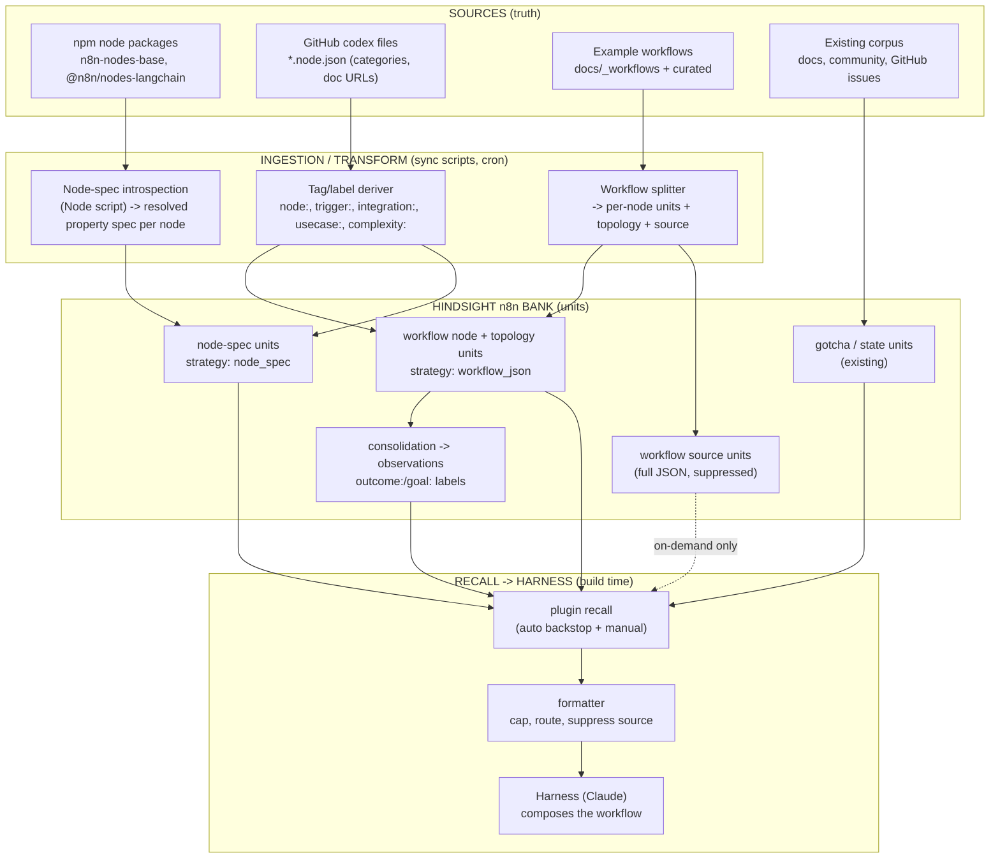
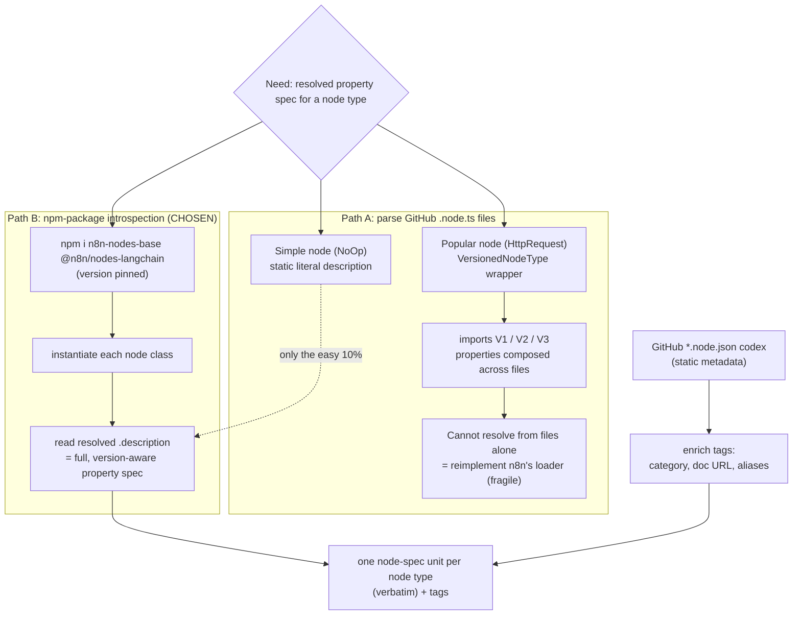
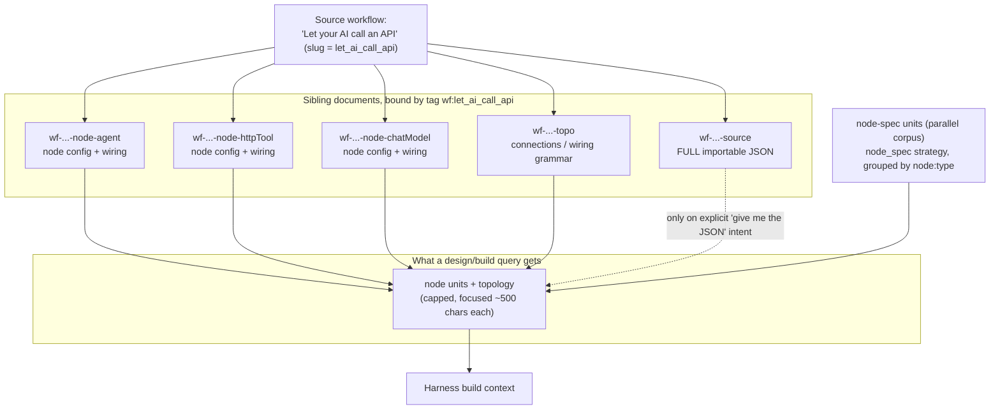
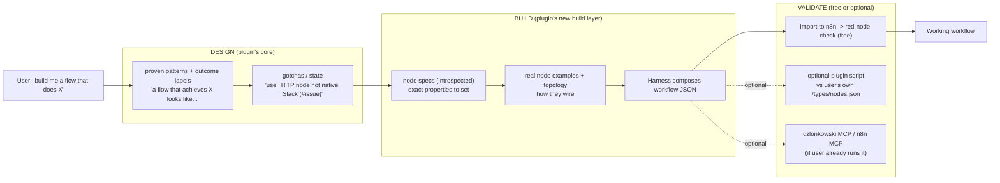

<!-- created: 2026-06-05T15:40:00 -->
# n8n-knowledge "Build Layer" — Technical Pipeline (Task #85)

**Created: 2026-06-05 15:40**

**Overarching goal:** make the n8n-knowledge plugin able to hand the harness (Claude) everything it needs to *build* an n8n workflow — node-by-node — as zero-friction injected context. Not "copy-paste a whole vetted workflow," but "here's how to configure each node, how nodes wire together, what real examples look like, and what bites you." Three knowledge types feed this: **node specs** (how to build any node), **workflow examples** (how nodes combine to reach a goal), **gotchas/state** (what's wise / what's broken).

This document explains the four technical pieces that produce and serve that context.

---

## 1. End-to-end information flow

**What this shows:** every source of truth, how each is transformed into Hindsight memory units, and how those units reach the harness at build time.

**Key insight:** four different sources, but a single destination — small, queryable units in the n8n bank that the formatter assembles into just-in-time build context. The full workflow JSON (`USRC`) is stored but deliberately kept *out* of normal recall (dotted line) until explicitly asked for.

**Why it matters:** this is what lets the plugin answer "help me build X" with zero install — the harness pulls node specs + real examples + gotchas frictionlessly, instead of the user standing up an MCP.

---

## 2. The node-spec step — why introspection, not file parsing

**What this shows:** why we cannot just `gh`-fetch node source from GitHub to get property specs, and what we do instead.

**Key insight:** a node's *resolved* spec only exists after the code runs. Simple nodes are static literals, but the nodes people actually use (HTTP Request, Set, Slack, Google*) are `VersionedNodeType` wrappers that compose properties across imported V1/V2/V3 files — verified against n8n source. So we **execute** the published packages and read each node's `.description`. GitHub is still used, but only for the *static* codex metadata that enriches tags.

**Why it matters:** introspection makes the corpus authoritative (the same resolution n8n itself does), reproducible (version-pinned), instance-independent, and owned end-to-end by us — not dependent on anyone else's extracted database.

---

## 3. The data model — sibling-docs-by-tag

**What this shows:** how one example workflow becomes many small documents bound by a tag, and exactly what recall returns vs. what stays out of context. (Driven by a hard API rule: Hindsight rejects duplicate `document_id` in a batch, so each unit must be its own document.)

**Key insight:** the workflow *is* the group of node units (joined by the `wf:<slug>` tag), not one big blob. Recall returns the small, relevant node + topology units; the full JSON (`wf-...-source`) sits in the bank but is **suppressed** from normal recall and surfaced only on explicit intent — so the harness gets focused building blocks, never an 18 KB workflow dumped into context uninvited.

**Why it matters:** this is what makes "guideline, not regurgitation" real and token-cheap — and `wf:<slug>` still lets us *gather* the whole thing on demand.

---

## 4. The design → build → validate journey (who plays where)

**What this shows:** the user's path from intent to a working workflow, and which system carries each leg — clarifying that the plugin owns design+build context while validation/deploy is free or optional.

**Key insight:** the plugin carries the two legs that are actually hard and high-friction today — **design** and **build** context, injected with zero setup. Validation, the MCP's headline feature, is the *cheapest* leg: it's free the moment you import to n8n (red nodes), or an optional script pointed at the user's own instance. Nobody's core pain is "I lack a validator"; the felt pain is setup friction — which the zero-install plugin removes.

**Why it matters:** it locates our durable value (frictionless design+build knowledge, plus the experiential/contributed layer a schema mirror can never hold) and treats validate/deploy as commodity legs we don't need to own.

---

## Confidence & risk (light scorecard)

| Piece | Confidence | Risk | Note |
|---|---|---|---|
| Node-spec introspection | ✓✓✓ HIGH | 2 LOW | n8n's own resolution; proven approach (czlonkowski does same) |
| Sibling-docs-by-tag | ✓✓✓ HIGH | 2 LOW | Empirically proven; forced by duplicate-document_id rule |
| Verbatim node/topology units | ✓✓✓ HIGH | 2 LOW | Byte-faithful recall confirmed in experiment |
| `outcome:` consolidation labels | ✓✓○ MED | 6 HIGH | Needs per-strategy `enable_observations` scoping verified |
| Formatter intent-gating (suppress source, cap nodes) | ✓✓○ MED | 4 MOD | New plugin logic; TDD slice; failure = token bloat, not correctness |
| Full node-spec corpus scope | ✓✓○ MED | 4 MOD | Large but relevance-ranked; long tail surfaces only when relevant |

**Top open item:** verify async consolidation honors per-item `strategy` so `enable_observations:false` (and later, `outcome:` labels) scope correctly — before production on the live n8n bank.
