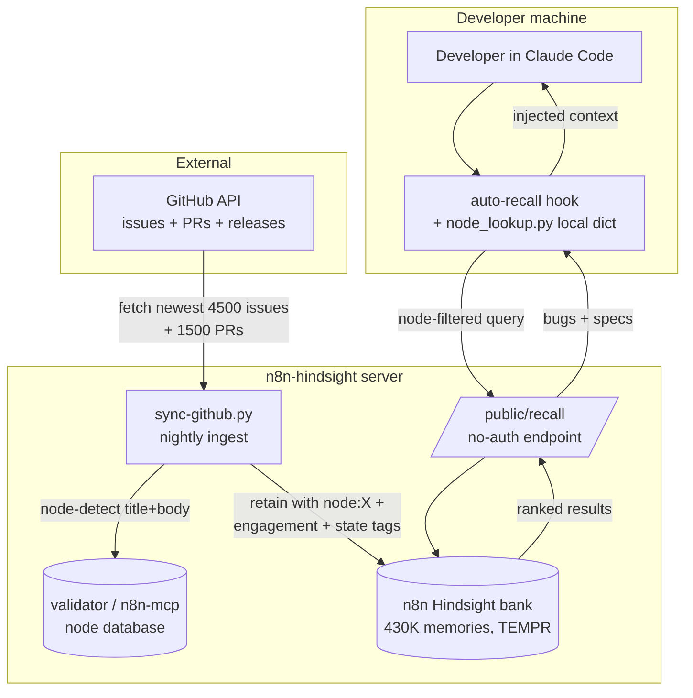
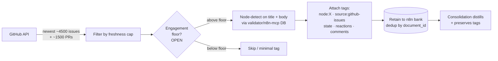
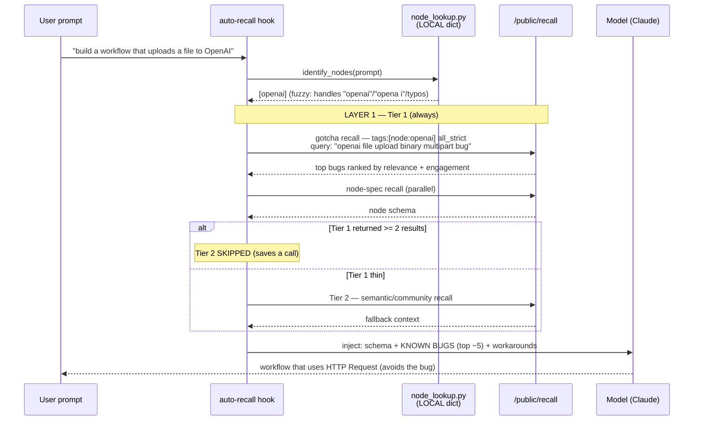
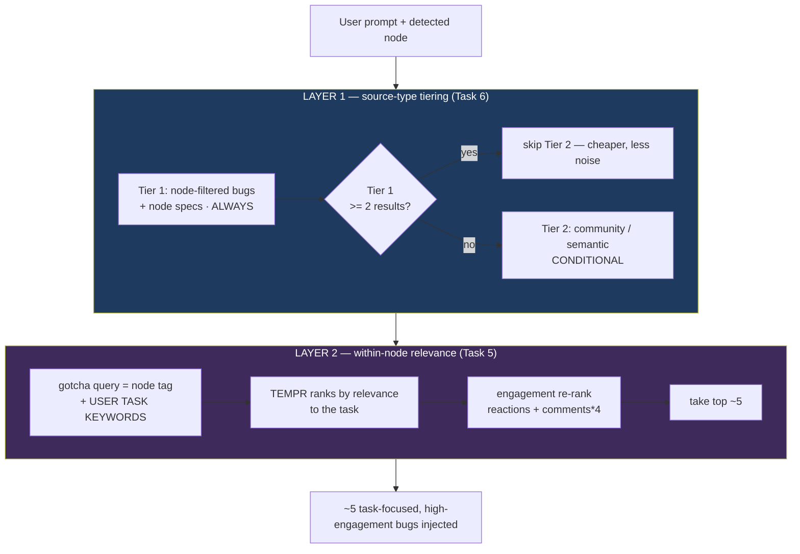
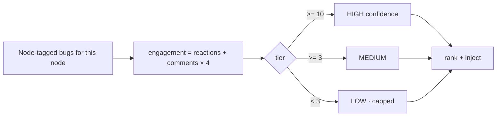
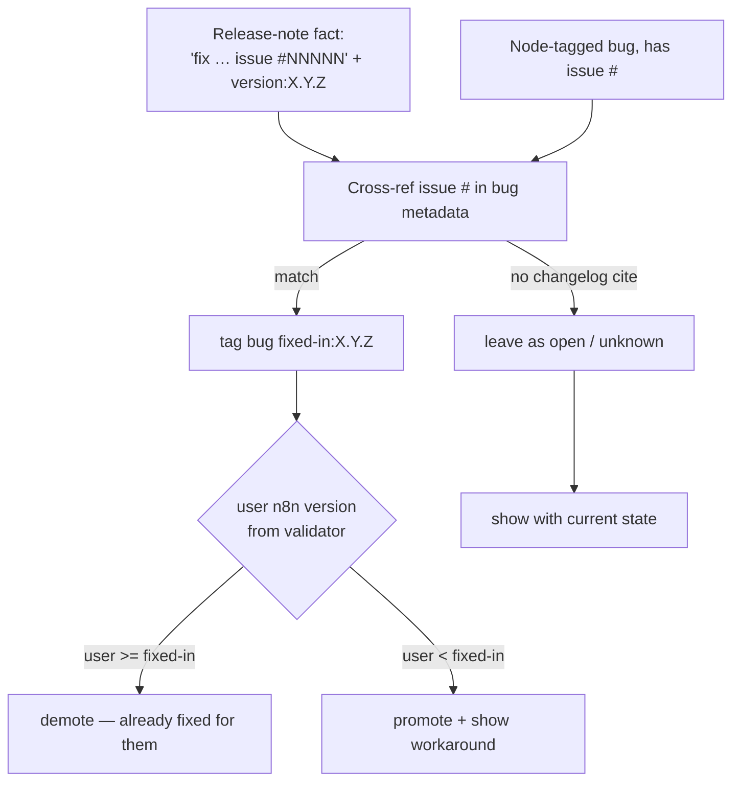
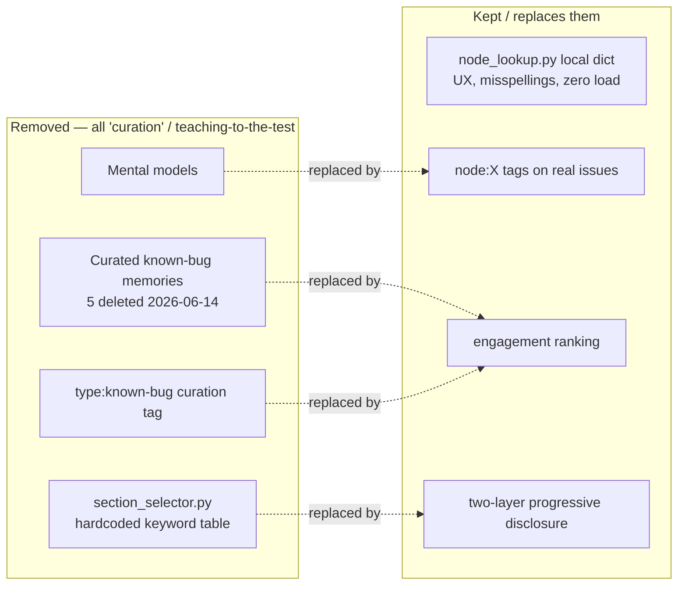

# n8n-knowledge — Version-Aware Bug Surfacing Architecture

**Status:** Design (Branch B, validated). Plan: `docs/superpowers/plans/2026-06-13-version-aware-bug-tagging.md`
**Date:** 2026-06-15
**One-line goal:** Surface the *right* node's known bugs to the model by tagging the whole GitHub corpus with `node:X` at ingest, then letting **engagement ranking** + **two-layer progressive disclosure** pick what the model sees — no hand-curated bug lists (no "teaching to the test").

---

## 0. TL;DR — the mental model

There are **two completely separate pipelines**. Confusing them is what makes this feel tangled:

| | **INGEST pipeline** | **RECALL pipeline** |
|---|---|---|
| Runs | Server-side, nightly (n8n-hindsight) | On the user's machine, per prompt (plugin hook) |
| Frequency | Once per issue (dedup) | Every prompt |
| Server load | Batch, one-time | **Zero** extra load (local dict + 1-3 recall calls) |
| Job | Tag issues `node:X`, bake engagement/state/version into the bank | Detect nodes in the prompt, fetch the relevant bugs, rank, inject |

"Progressive disclosure" lives entirely in the **recall** pipeline and has **two layers** (§4).

---

## 1. System Context — where this lives

> **What this shows:** the feature's boundaries and who talks to whom.
> **Key insight:** the plugin only ever calls one cheap public endpoint; all the heavy tagging happens server-side at ingest.



---

## 2. INGEST pipeline — how issues get `node:X` tags

> **What this shows:** the one-time/nightly server-side job that makes bugs findable by node.
> **Key insight:** node detection here is a *separate* server-side detector from the plugin's local dict. It reads the validator/n8n-mcp node DB on the server — users never need a local `nodes.db`.



**Release notes** are already done — no re-retain needed. They consolidated into atomic facts like *"Bug fix: … (issue #14259)"*, each carrying `version:X.Y.Z` as a tag + metadata. That's the linking key for version-awareness (§6).

---

## 3. RECALL pipeline — what happens on every prompt

> **What this shows:** the per-prompt flow on the user's machine.
> **Key insight:** the local dict (misspelling-tolerant node detection) runs first and locally — zero server load. Then progressive disclosure decides how many server calls to make.



---

## 4. The two-layer progressive disclosure (the part that's easy to lose)

> **What this shows:** the two independent filters that keep the model from drowning in a dense node's 40 bugs.
> **Key insight:** Layer 1 decides *which source types*; Layer 2 decides *which bugs of the chosen node*. Together they mean the model sees ~5 bugs that are all about the exact thing it's building — not 5 random ones.



**Why this dissolves the "n=5" worry.** The old mental-model plan picked "5 gotchas minimum" because *"the model can't synthesize 5+ **scattered** results."* With Layer 2, the 5 aren't scattered — they're all about *file upload to OpenAI*, not 5 random picks from OpenAI's 40 bugs. Five focused warnings are trivially digestible, so we don't need a synthesis/curation layer.

**Status check (important):** Layer 1 (tiering) is **designed, not yet built** — current code fires everything in parallel. Layer 2's task-aware query is **the missing piece** — today's gotcha query is node-name-only (`"openai node bug issue workaround error"`), which can't tell a file-upload task from a credential task. Making it task-aware is the key build step.

---

## 5. Engagement ranking — the *only* selection criterion (no curation)

> **What this shows:** how "which bugs matter" is decided without a hand-picked list.
> **Key insight:** known gotchas surface because they're genuinely high-engagement — generalizable, and it can't be gamed to pass the eval.



- `high_engagement_threshold: 10`, `medium_engagement_threshold: 3` (`plugin_config.py`). These are **display tiers**.
- **OPEN decision:** a separate *re-retain inclusion floor* (which issues are even worth tagging). No value was ever set — the "5" you remembered was the per-node mental-model density threshold, a different axis.

---

## 6. Version awareness — "is this bug fixed for MY version?"

> **What this shows:** how a bug gets a `fixed-in:X.Y.Z` tag and how the plugin uses the user's version.
> **Key insight:** release notes already carry issue→version, so this is mostly cross-referencing. Coverage is partial (some fixes never cite an issue #).



---

## 7. What's being REMOVED (and why)



`node_lookup.py` (the local fuzzy dict) is **NOT** removed — it's the prompt-side detector, runs locally, essential for UX.

---

## 8. Build status & open decisions

| Piece | State |
|---|---|
| Remove curated test memories | ✅ done (5 deleted, verified) |
| Release-note issue→version facts | ✅ already in bank |
| retain/observations missions | ✅ already n8n-tuned |
| `node:X` tagging in `sync-github.py` | ⬜ to build (server-side, validator DB) |
| `all_strict` on node recall | ⬜ to build (else untagged noise leaks) |
| Layer 1 tiering (Tier 2 conditional) | ⬜ designed, not built |
| Layer 2 task-aware gotcha query | ⬜ **missing piece** for dense nodes |
| `fixed-in` cross-ref | ⬜ best-effort, partial |
| Drop mental models + section_selector | ⬜ to build |

**Open decisions for Dan:**
1. **Engagement re-retain floor** — which issues are worth tagging at all? (≥3 reuse medium tier, ≥5, or tag-all.) No prior value exists.
2. **Auto-synthesis fallback for dense nodes** — likely unnecessary if Layer 2 is built; recommend *measure first*.

---

## Validation summary

```
DESIGN HEALTH: 88%

CONFIDENCE
  HIGH  : node:X tagging, engagement ranking, release-note version facts,
          local-dict separation (all proven / already in bank)
  MEDIUM: Layer 1 tiering (designed not built), all_strict at scale
          (verified semantically, not yet load-tested)
  LOW   : Layer 2 task-aware query quality on dense nodes (the one to prove)

TOP RISKS
  1. [6 HIGH] Layer 2 not built → dense nodes (OpenAI ~40 bugs) inject a
     generic 5, model may still pick the broken path.
     → Build task-aware gotcha query; measure dense-node eval before any fallback.
  2. [4 MOD] all_strict unverified at 430K scale (couldn't test — curated data
     was deleted). → Re-test in Task 2 with a real node-tagged sample.
  3. [4 MOD] fixed-in coverage partial (fixes that cite no issue #).
     → Accept; log coverage %. Matches existing task #83.
  4. [3 MOD] Engagement floor undecided → either over-ingest noise or drop real
     low-engagement bugs. → Dan picks the floor.

NO CRITICAL (9-12) RISKS. Ready for review.
```
